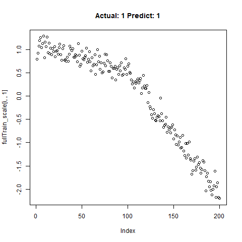
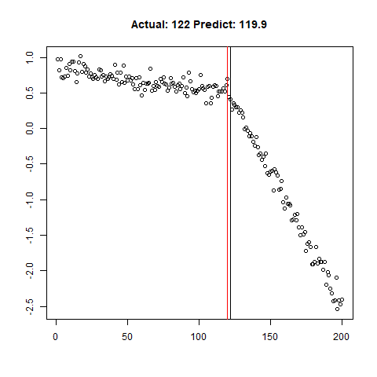

## Motivation:

Often in my line of work I'm asked to identify "kinks", curves or bends in XY graph data, and I've spent inordinate amounts of time coding up various algorithms to find the change in the slope or threshold a change in the deviation around a linear fit, etc. These algorithms are never terrible accurate, and after taking most of Andrew Ng's excellent [Conv Nets](https://www.coursera.org/learn/convolutional-neural-networks) class on Coursera last year, I've often wondered if CNN's could be configured to be used for this type of work. Instead of passing images to CNN's, could we pass the graph data itself directly, and then configure the model to recognize the shape we want?

## It's Already Been Done...?

1D CNN's apparently have a robust history of being used for classification in time series data. instead of passing 2D arrays of RBG values, folks pass in 1D arrays of "y" values from our X-Y chart. Assuming constant X-axis spacing, of course. The X-axis could probably just be another feature, if it was needed. Anyway, of the various examples out there, [Jason Brownlee's](https://machinelearningmastery.com/cnn-models-for-human-activity-recognition-time-series-classification/) seems to be the original that everyone refers too.

However, most of the work I see with 1D Conv Nets is only limited to classification. Can we really use it for quantitative prediction of aspects of these features, beyond simply detection? My approach here is in three steps...

A.  Use CNN's as a classifier to predict whether or not a segment has the feature. Simply use a 2-unit dense Softmax layer at the end of the network to predict the probability of a "Yes".

B.  Using just the subset of samples classified as "Yes", predict the "location" of the feature using a 1-unit dense Relu layer.

C.  Again using just the subset of samples classified as "Yes", making predictions quantifying the shape of the feature using a 1-unit dense Relu layer.

{width="700"}

## Methods...

To test the capability of Conv Nets to do A - C, I created some simulated data with a simple two-slope compound line. I wanted to see if the CNNs could detect whether or not the slope changed, regardless of the initial slope or the quantity of noise around the slope. The nice thing about XY data is that it's very easy to generate lots of training data computationally! I created 20,000 samples as a training set, and randomly added the slope change to half the samples. For each sample, it was easy enough to record A) Yes/No for the feature presence, B) the feature Location, and C) the Slope of the feature.

## Build a Training Set

```{r Build training set, echo=TRUE,eval=FALSE}

library(data.table)

q <- 20000 # Total number of samples
l <- 200 # Vector length of each sample
xfull <- 1:l
X <- data.table(n = integer(q*l),
                y = numeric(q*l),
                truth = integer(q*l),
                loc = integer(q*l),
                slope1 = numeric(q*l),
                slope2 = numeric(q*l),
                slopediff = numeric(q*l)
                )

for (i in 1:q) {
    
    rstart <- (i - 1)*l + 1
    rend <- i*l
    
    # For half the samples, create a compound, noisy line with two different slope segments
    if (sample(c(0,1),1) == 1) {
        
        cross <- sample(seq(from = 0.3*l,to = 0.7*l,by = 1),1) + round(rnorm(1,sd = 20),digits = 0)
        while ((cross < 10) || (cross > (l - 10))) {
            cross <- sample(seq(from = 0.3*l,to = 0.7*l,by = 1),1) + round(rnorm(1,sd = 30),digits = 0)
        }
        x1 <- 1:cross
        x2 <- 1:(l - cross)
        
        y1 <- rnorm(1,mean = -0.1,sd = 0.05)
        while (y1 > 0) {
            y1 <- rnorm(1,mean = -0.1,sd = 0.05)
        }
    
        y2 <- rnorm(1,mean = -0.7,sd = 0.5)
        while (y2 > (y1 - 0.05)) {
            y2 <- rnorm(1,mean = -0.7,sd = 0.5)
        }
        
        Y1 <- y1*x1
        Y2 <- y2*x2 - abs(min(Y1))
    
        Y <- c(Y1,Y2)
        n <- rnorm(length(Y),mean = 1,sd = 0.03)
        Y <- Y*n + rnorm(length(Y),sd = 2)

        X[(rstart:rend),n := i]
        X[(rstart:rend),y := Y]
        X[(rstart:rend),truth := 1L]
        X[(rstart:rend),loc := cross]
        X[(rstart:rend),slope1 := y1]
        X[(rstart:rend),slope2 := y2]
        X[(rstart:rend),slopediff := y1 - y2]

    # For the other "No" samples without a feature, use just one slope
    } else {
        
        y1 <- rnorm(1,mean = -0.3,sd = 0.3)
        while (y1 > 0) {
            y1 <- rnorm(1,mean = -0.1,sd = 0.05)
        }
        
        Y <- y1*xfull
        n <- rnorm(length(Y),mean = 1,sd = 0.03)
        Y <- Y*n + rnorm(length(Y),sd = 2)
        
        X[(rstart:rend),n := i]
        X[(rstart:rend),y := Y]
        X[(rstart:rend),truth := 0L]
        X[(rstart:rend),loc := 0L]
        X[(rstart:rend),slope1 := NA_real_]
        X[(rstart:rend),slope2 := NA_real_]
        X[(rstart:rend),slopediff := NA_real_]
        
    }
    
}
```

Now let's take a look at what we've got:

|                                   |                                   |                                    |
|-----------------------------------|-----------------------------------|------------------------------------|
| {width="330"} | {width="330"} | {width="330"}  |
| {width="330"} | {width="330"} | {width="330"} |

: Sampling the Training Set

Looks good. Now can prepare the training data for our ML model.

```{r Prepare for Machine Learning, echo=TRUE,eval=FALSE}

# Get train / test split
train_index <- sample(unique(X$n),round(0.9*q,digits = 0),replace = FALSE)
test_index <- setdiff(unique(X$n),train_index)

x_train <- X[(n %in% train_index),y]
x_test <- X[(n %in% test_index),y]

y_train <- X[(n %in% train_index),head(.SD,1),by = n]$truth
y_test <- X[(n %in% test_index),head(.SD,1),by = n]$truth

# Reshape for scaling
x_train <- array(x_train,dim = c(l,length(train_index)))
x_test <- array(x_test,dim = c(l,length(test_index)))

x_train_scale <- scale(x_train)
x_test_scale <- scale(x_test)

x_train_scale <- t(x_train_scale)
x_test_scale <- t(x_test_scale)

x_train_scale <- array(x_train_scale,dim = c(length(train_index),l,1))
x_test_scale <- array(x_test_scale,dim = c(length(test_index),l,1))

```

## Using 1D CNN's to Detect the Feature

```{r Print Plots, eval = FALSE, echo = TRUE}

library(keras)

classification_model <- keras_model_sequential() %>% 
    layer_conv_1d(filters = 32, kernel_size = 5, activation = "relu",input_shape = c(l,1),strides = 10L) %>%
    layer_conv_1d(filters = 32, kernel_size = 5,strides = 1L) %>%
    layer_max_pooling_1d() %>%
    layer_conv_1d(filters = 32, kernel_size = 5,strides = 1L) %>%
    layer_dropout(0.5) %>%
    layer_flatten() %>%
    layer_dense(units = 2, activation = "softmax")


classification_model %>% compile(loss = 'sparse_categorical_crossentropy',
                  optimizer = 'adam',
                  metrics = 'accuracy')

classification_model %>% summary()

classification_model %>% fit(x_train_scale, y_train, epochs = 25, verbose = TRUE)

classification_test_score <- classification_model %>% evaluate(x_test_scale, y_test, verbose = TRUE)
```

Running this model easily gains high accuracy. The classification_test_score gives an accuracy 0.990.

|                                    |                                    |                                    |
|------------------------------------|------------------------------------|------------------------------------|
| {width="330"}  | {width="330"}  | {width="330"}  |
| {width="330"}  | {width="330"}  | {width="330"} |
| {width="330"} | {width="330"} | {width="330"} |

: Classification Results

Now we will take only the true "Yes" results from the training set and attempt to build a regression model that takes uses CNNs on the front end for feature learning and dense layers for regression on the back end.

```{r Regression Location Model, eval=FALSE,echo=TRUE}

yesIndex <- X[truth == 1,unique(n)]

train_index_regr <- sample(yesIndex,round(0.9*length(yesIndex),digits = 0),replace = FALSE)
test_index_regr <- setdiff(yesIndex,train_index_regr)

length(train_index_regr)
length(test_index_regr)
length(train_index_regr) + length(test_index_regr)

x_train_regr <- X[(n %in% train_index_regr),y]
x_test_regr <- X[(n %in% test_index_regr),y]

y_train_regr <- X[(n %in% train_index_regr),head(.SD,1),by = n]$loc/l
y_test_regr <- X[(n %in% test_index_regr),head(.SD,1),by = n]$loc/l

# Reshape for scaling
x_train_regr <- array(x_train_regr,dim = c(l,length(train_index_regr)))
x_test_regr <- array(x_test_regr,dim = c(l,length(test_index_regr)))

x_train_scale_regr <- scale(x_train_regr)
x_test_scale_regr <- scale(x_test_regr)

x_train_scale_regr <- t(x_train_scale_regr)
x_test_scale_regr <- t(x_test_scale_regr)

x_train_scale_regr <- array(x_train_scale_regr,dim = c(length(train_index_regr),l,1))
x_test_scale_regr <- array(x_test_scale_regr,dim = c(length(test_index_regr),l,1))

for (i in sample(1:dim(x_train_scale_regr)[2],10)) {
    print(i)
    plot(x_train_scale_regr[i,,1],main = paste0("Actual: ",y_train_regr[i]))
    x <- readline("")
    if (x == "q") {
        break
    }
}

# Regression for Location ############################################################################

regression_model <- keras_model_sequential() %>% 
    layer_conv_1d(filters = 32, kernel_size = 5, activation = "relu",input_shape = c(l,1),strides = 5L) %>%
    layer_dropout(0.5) %>%
    layer_conv_1d(filters = 32, kernel_size = 5,strides = 1L) %>%
    layer_dropout(0.5) %>%
    layer_max_pooling_1d() %>%
    layer_conv_1d(filters = 32, kernel_size = 5,strides = 1L) %>%
    layer_dense(units = 16) %>%
    layer_flatten() %>%
    layer_dense(units = 1, activation = "linear")

regression_model %>% compile(
        loss = "mse",
        optimizer = "adam",
        metrics = "mean_absolute_error")

regression_model %>% summary()

regression_model %>% fit(x_train_scale_regr, y_train_regr, epochs = 35, verbose = TRUE)

regression_model %>% evaluate(x_test_scale_regr, y_test_regr, verbose = TRUE)

predict_regr <- regression_model %>% predict(x_test_scale_regr)

predict_regr <- predict_regr*l
```

The regression results are fairly good, based on the random samples checked below:

Regression Results:

|                                  |                                  |                                  |
|----------------------------------|----------------------------------|----------------------------------|
| {width="330"} | {width="330"} | {width="330"} |
| {width="330"} | {width="330"} | {width="330"} |
| {width="330"} | {width="330"} | {width="330"} |

: Regression: Predict Location

## Going Further - Predicting Quantitative Feature Aspects

Can we use the same type of 1D Conv Net Regression model to predict the slope of the lines within our training data set? Why not! The code below is for the first slope only, but can be easily used for the slope of the second line.

```{r PredictSlope1, echo=TRUE,eval=FALSE}

##### Regression for Y1 ################################################
y_train_slope1 <- X[(n %in% train_index_regr),head(.SD,1),by = n]$slope1
y_test_slope1 <- X[(n %in% test_index_regr),head(.SD,1),by = n]$slope1

# scaling
y_train_slope1_scale <- scale(y_train_slope1)
y_test_slope1_scale <- scale(y_test_slope1)

scale_slope1_train <- attributes(y_train_slope1_scale)
scale_slope1_test <- attributes(y_test_slope1_scale)

y_train_slope1_scale[is.na(y_train_slope1_scale)] <- 0
y_test_slope1_scale[is.na(y_test_slope1_scale)] <- 0

slope1_model <- keras_model_sequential() %>% 
    layer_conv_1d(filters = 32, kernel_size = 5, activation = "relu",input_shape = c(l,1),strides = 5L) %>%
    layer_dropout(0.5) %>%
    layer_conv_1d(filters = 32, kernel_size = 5,strides = 1L) %>%
    layer_dropout(0.5) %>%
    layer_max_pooling_1d() %>%
    layer_conv_1d(filters = 32, kernel_size = 5,strides = 1L) %>%
    layer_dense(units = 16) %>%
    layer_flatten() %>%
    layer_dense(units = 1, activation = "linear")

slope1_model %>% compile(
    loss = "mse",
    optimizer = "adam",
    metrics = "mean_absolute_error")

slope1_model %>% summary()

slope1_model %>% fit(x_train_scale_regr, y_train_slope1_scale, epochs = 25, verbose = TRUE)

slope1_model %>% evaluate(x_test_scale_regr, y_test_slope1_scale, verbose = TRUE)

predict_slope1 <- slope1_model %>% predict(x_test_scale_regr)

# Unscale for plotting
predict_slope1 <- (predict_slope1*scale_slope1_test$`scaled:scale` + scale_slope1_test$`scaled:center`)

```

The loss / accuracy plots show that the network appears to be learning quite nicely.

{width="300"}

Let's combine the regression predictions for feature location and the two slopes, and take a look at the results. Black is actual, red is predicted.

|                                  |                                  |                                  |
|----------------------------------|----------------------------------|----------------------------------|
| {width="330"}  | {width="330"}  | {width="330"} |
| {width="330"} | {width="330"} | {width="480"} |
| {width="330"} | {width="330"} | {width="330"} |

: Combined Regression Results

Clearly, the Location and Slope 2 predictions could use some work. The Slope 2 predictions are particularly challenging for our CNN's, since they need to learn to ignore all of the Slope 1 data. There's lots of obvious ways to improve the accuracy for this toy example (more data, deeper network, more training epochs), but something more interesting might be reverse the incoming data, since the Slope 1 predictions are better, or use the location prediction to cut off the data, and the classify on the remainder. This data reduction would possibly give the CNN's much more success, since they won't be so distracted with Slope 1 data.

## Conclusion

It's clearly possible to use 1D CNN's for not only feature identification, but feature quantitative prediction, using a combination of CNN's and dense layers. Although the two-slope feature shown in this example is very simple, more complex and prominent features might be actually easier to recognize, as the slope change in the example is very subtle. This is an exciting result for me personally, and I'm intending to use 1D CNN's more extensively in my future projects.
