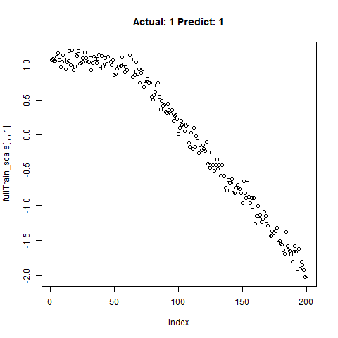

## Motivation:

Often in my line of work I'm asked to identify "kinks", curves or bends in XY graph data, and I've spent inordinate amounts of time coding up various algorithms to find the change in the slope or threshold a change in the deviation around a linear fit, etc. These algorithms are never terrible accurate, and after taking most of Andrew Ng's excellent [Conv Nets](https://www.coursera.org/learn/convolutional-neural-networks) class on Coursera last year, I've often wondered if CNN's could be configured to be used for this type of work. Instead of passing images to CNN's, could we pass the graph data itself directly, and then configure the model to recognize the shape we want?

## It's Already Been Done...?

1D CNN's apparently have a robust history of being used for classification in time series data. instead of passing 2D arrays of RBG values, folks pass in 1D arrays of "y" values from our X-Y chart. Assuming constant X-axis spacing, of course. The X-axis could probably just be another feature, if it was needed. Anyway, of the various examples out there, [Jason Brownlee's](https://machinelearningmastery.com/cnn-models-for-human-activity-recognition-time-series-classification/) seems to be the original that everyone refers too.

However, most of the work I see with 1D Conv Nets is only limited to classification. Can we really use it for quantitative prediction of aspects of these features, beyond simply detection? My approach here is in three steps...

A.  Use CNN's as a classifier to predict whether or not a segment has the feature. Simply use a 2-unit dense Softmax layer at the end of the network to predict the probability of a "Yes".

B.  Using just the subset of samples classified as "Yes", predict the "location" of the feature using a 1-unit dense Relu layer.

C.  Again using just the subset of samples classified as "Yes", making predictions quantifying the shape of the feature using a 1-unit dense Relu layer.


## Methods...

To test the capability of Conv Nets to do A - C, I created some simulated data with a simple two-slope compound line. I wanted to see if the CNNs could detect whether or not the slope changed, regardless of the initial slope or the quantity of noise around the slope. The nice thing about XY data is that it's very easy to generate lots of training data computationally! I created 20,000 samples as a training set, and randomly added the slope change to half the samples. For each sample, it was easy enough to record A) Yes/No for the feature presence, B) the feature Location, and C) the Slope of the feature.

## Using 1D CNN's to Detect the Feature

```{r Print Plots, eval = FALSE, echo = TRUE}

library(keras)

classification_model <- keras_model_sequential() %>% 
    layer_conv_1d(filters = 32, kernel_size = 5, activation = "relu",input_shape = c(l,1),strides = 10L) %>%
    layer_conv_1d(filters = 32, kernel_size = 5,strides = 1L) %>%
    layer_max_pooling_1d() %>%
    layer_conv_1d(filters = 32, kernel_size = 5,strides = 1L) %>%
    layer_dropout(0.5) %>%
    layer_flatten() %>%
    layer_dense(units = 2, activation = "softmax")


classification_model %>% compile(loss = 'sparse_categorical_crossentropy',
                  optimizer = 'adam',
                  metrics = 'accuracy')

classification_model %>% summary()

classification_model %>% fit(x_train_scale, y_train, epochs = 25, verbose = TRUE)

classification_test_score <- classification_model %>% evaluate(x_test_scale, y_test, verbose = TRUE)
```

Running this model easily gains high accuracy. The classification_test_score gives an accuracy 0.990.

|                       |                       |                            |
|-----------------------|-----------------------|----------------------------|
|   |   |        |
|   |   |       |
|  |  |  |

: Classification Results

Regression Results:

|                     |                     |                     |
|---------------------|---------------------|---------------------|
|  |  |  |
|  |  |  |
|  |  |  |

: Regression: Predict Location
